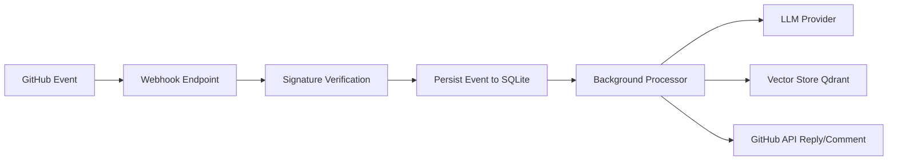

# FOSSMate

FOSSMate is an open-source GitHub App backend that acts as an AI maintainer assistant for repositories.

It is designed to reduce maintainer load on repetitive triage and onboarding tasks by combining:

- GitHub webhooks
- LLM provider abstraction (Gemini, OpenAI, Ollama, OpenAI-compatible endpoints)
- RAG-ready architecture (Qdrant + ingestion pipeline)
- Async FastAPI backend with persistent event history

## Project Status

`MVP scaffold`.

The current codebase is a working foundation with:

- Webhook receiver with signature verification
- Async database models and persistence
- Swappable LLM provider interface with Gemini implemented and tested
- Testing utility endpoints and local development scripts

The repository is intentionally structured so production behaviors (full triage automation, repository ingestion, RAG answers, PR/issue auto-comments) can be added incrementally without redesigning the core.

## Who This Is For

- Maintainers who want an AI assistant for issue/PR workflows
- Organizations that want to self-host a GitHub App for internal/public repos
- Contributors building AI-assisted OSS tooling

## High-Level Plan

FOSSMate evolves in 4 phases:

1. Foundation (current): webhook intake, config, provider abstraction, persistence.
2. Intelligence: issue summary generation, label suggestions, contributor onboarding responses.
3. Retrieval: repo ingestion + vector indexing + grounded Q&A.
4. Production hardening: queue workers, retries, observability, multi-installation controls.

## How FOSSMate Works



Runtime flow:

1. A GitHub repo event hits `/webhooks/github`.
2. FOSSMate validates `X-Hub-Signature-256` using your webhook secret.
3. Event payload is stored in `webhook_events` for audit and replay.
4. Background tasks execute automation logic (currently scaffolded with TODO handlers).
5. Future versions call LLM + RAG and post contextual responses on issues/PRs.

## Architecture

- Backend: FastAPI + async SQLAlchemy
- Database: SQLite (dev default), easy migration path to Postgres
- Vector DB: Qdrant (in-memory or containerized)
- LLM support:
  - Gemini
  - OpenAI
  - Ollama
  - Custom OpenAI-compatible endpoint

## Repository Layout

```text
.
├── backend/
│   ├── app/
│   │   ├── main.py
│   │   ├── config.py
│   │   ├── models/
│   │   ├── routers/
│   │   ├── services/
│   │   └── utils/
│   ├── requirements.txt
│   └── test_llm.py
├── docs/
├── scripts/
│   └── setup_github_app.py
├── .env.example
├── docker-compose.yml
└── README.md
```

## Quick Start (Self-Hosted)

### 1. Clone and install

```bash
git clone https://github.com/Zenkai-src/FOSSMate.git
cd FOSSMate
conda create -n fossmate python=3.11 -y
conda activate fossmate
pip install -r backend/requirements.txt
```

### 2. Configure environment

```bash
cp .env.example .env
```

Fill in required values in `.env`:

- `GITHUB_APP_ID`
- `GITHUB_PRIVATE_KEY`
- `GITHUB_WEBHOOK_SECRET`
- `LLM_PROVIDER`
- `LLM_API_KEY` (for Gemini/OpenAI/custom)
- `LLM_MODEL_NAME`

### 3. Run backend

```bash
cd backend
uvicorn app.main:app --reload --port 8000
```

Health check:

```bash
curl http://127.0.0.1:8000/health
```

### 4. Expose webhook publicly (for local development)

Use ngrok (or Cloudflare Tunnel):

```bash
ngrok http 8000
```

Webhook URL in GitHub App settings should be:

```text
https://<your-tunnel-domain>/webhooks/github
```

## GitHub App Setup (for actual repos)

Use the helper script to generate a setup checklist:

```bash
python scripts/setup_github_app.py --print-checklist
```

Then in GitHub App settings:

- Webhook URL: `https://<public-domain>/webhooks/github`
- Webhook Secret: exactly `GITHUB_WEBHOOK_SECRET` from `.env`

Recommended permissions/events for current scope:

- Repository permissions:
  - Issues: Read & Write
  - Pull requests: Read & Write
  - Metadata: Read-only
  - Contents: Read-only (needed for ingestion later)
- Subscribe to events:
  - Issues
  - Issue comment
  - Pull request
  - Installation
  - Installation repositories

Install the app into target repositories, then open issues/PRs to trigger workflows.

## LLM Provider Configuration

### Gemini (default)

```env
LLM_PROVIDER=gemini
LLM_API_KEY=<your_key>
LLM_MODEL_NAME=gemini-2.0-flash
LLM_EMBEDDING_MODEL=models/text-embedding-004
```

### OpenAI

```env
LLM_PROVIDER=openai
LLM_API_KEY=<your_key>
LLM_MODEL_NAME=gpt-4o-mini
```

### Ollama (local)

```env
LLM_PROVIDER=ollama
LLM_ENDPOINT=http://localhost:11434
LLM_MODEL_NAME=llama3.1
```

### Custom OpenAI-compatible

```env
LLM_PROVIDER=custom
LLM_ENDPOINT=https://your-endpoint/v1
LLM_API_KEY=<token>
LLM_MODEL_NAME=<model>
```

## Environment Variables

| Variable | Required | Description |
| --- | --- | --- |
| `APP_ENV` | No | `development`, `staging`, or `production` |
| `LOG_LEVEL` | No | Logging level |
| `GITHUB_APP_ID` | Yes | GitHub App ID |
| `GITHUB_PRIVATE_KEY` | Yes | GitHub App private key (supports escaped newlines) |
| `GITHUB_WEBHOOK_SECRET` | Yes | Secret used for webhook signature validation |
| `GITHUB_TOKEN` | No | Optional PAT for local/dev scripts |
| `LLM_PROVIDER` | Yes | `gemini`, `openai`, `ollama`, or `custom` |
| `LLM_API_KEY` | Depends | Required for `gemini`, `openai`, and `custom` |
| `LLM_MODEL_NAME` | Yes | Chat model name |
| `LLM_EMBEDDING_MODEL` | No | Embedding model name |
| `LLM_ENDPOINT` | Depends | Required for `custom`; defaults for `ollama` |
| `QDRANT_URL` | No | `in-memory` or hosted Qdrant URL |
| `DATABASE_URL` | No | SQLAlchemy async DB URL |
| `NGROK_AUTHTOKEN` | No | Optional local tunnel token |
| `WEBHOOK_PUBLIC_URL` | No | Optional helper value for setup scripts |

## Current Endpoints

- `GET /health`
- `POST /webhooks/github` (signature-verified)
- `POST /webhooks/github/test` (local payload testing)
- `GET /chat/ping`
- `GET /admin/ping`

## Local Verification

Run Gemini smoke test:

```bash
cd backend
python test_llm.py
```

## Roadmap

Near-term planned items:

- Implement real handlers for:
  - `issues.opened` summary + label suggestion
  - `issue_comment.created` onboarding detection/response
  - `pull_request.opened` summary
- Add ingestion pipeline for `.py`, `.js`, `.ts`, `.md`, `README*`, `CONTRIBUTING*`
- Add Qdrant-backed retrieval and source-cited answers
- Add queue worker (RQ/Celery/Arq) for resilient async execution
- Add integration tests for webhook signature/event handling

## Security Notes

- Never commit `.env`.
- Use unique webhook secrets per environment.
- Scope GitHub App permissions minimally.
- Rotate API keys and PATs periodically.

## Contributing

See `CONTRIBUTING.md`.

## License

MIT (see `LICENSE`).
