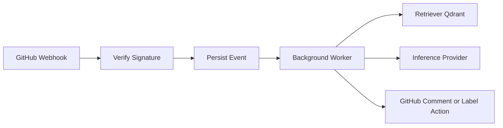

# FOSSMate

FOSSMate is an open-source GitHub App backend that helps maintainers triage issues, support contributors, and answer repository questions with retrieval-augmented context.

## OSS-First Core Principle

FOSSMate core functionality is designed to run without closed-source APIs.

Core stack:

- FastAPI backend
- SQLite/Postgres metadata store
- Qdrant vector store
- Ollama/local or self-hosted inference endpoints

Proprietary model APIs (Gemini/OpenAI) are supported only as optional adapters for MVP experimentation. They are not required for the architecture, deployment model, or roadmap.

## Project Status

`MVP scaffold` with production-oriented structure.

Implemented now:

- GitHub webhook ingestion with signature verification
- Idempotent delivery logging and queue-backed async processing
- Issue automation (`issues.opened` summary + label suggestion, `issue_comment.created` onboarding intent replies)
- PR automation (`pull_request.opened/synchronize` summary, file-level notes, suggestions, advisory scoring)
- Persistent review artifacts (`review_runs`, `review_findings`, `score_cards`, `developer_metrics`)
- Provider abstraction layer with fallback and multi-provider matrix
- Async FastAPI + SQLAlchemy foundation with admin replay/status endpoints

Planned next:

- Real issue/PR automation handlers
- Ingestion + chunking + indexing
- RAG answers with source references
- Worker queue and reliability controls
- GitLab adapter after GitHub production stabilization

## How It Works



## Repository Layout

```text
.
├── backend/
│   ├── app/
│   ├── requirements.txt
│   └── test_llm.py
├── docs/
├── scripts/
│   └── setup_github_app.py
├── .env.example
├── docker-compose.yml
└── README.md
```

## Quick Start (Self-Hosted)

```bash
git clone https://github.com/Zenkai-src/FOSSMate.git
cd FOSSMate
conda create -n fossmate python=3.11 -y
conda activate fossmate
pip install -r backend/requirements.txt
cp .env.example .env
```

Run API:

```bash
cd backend
uvicorn app.main:app --reload --port 8000
```

Health check:

```bash
curl http://127.0.0.1:8000/health
```

## Default Open-Source Inference Path

Default configuration uses local Ollama (no proprietary API dependency):

```env
LLM_PROVIDER=ollama
LLM_ENDPOINT=http://localhost:11434
LLM_MODEL_NAME=llama3.1
```

Pull model locally:

```bash
ollama pull llama3.1
```

## Optional Proprietary Adapters (Not Required)

You can optionally use Gemini/OpenAI/OpenRouter/custom OpenAI-compatible endpoints for MVP speed:

- `LLM_PROVIDER=gemini`
- `LLM_PROVIDER=openai`
- `LLM_PROVIDER=openrouter`
- `LLM_PROVIDER=custom`

These are adapters only; core architecture remains provider-independent.

## GitHub App Setup (Actual Repositories)

Generate checklist:

```bash
python scripts/setup_github_app.py --print-checklist
```

In GitHub App settings:

- Webhook URL: `https://<public-domain>/webhooks/github`
- Webhook secret: exact `GITHUB_WEBHOOK_SECRET` value from `.env`

Recommended permissions:

- Issues: Read & write
- Pull requests: Read & write
- Checks: Read & write
- Contents: Read-only
- Metadata: Read-only

Recommended events:

- Issues
- Issue comment
- Pull request
- Installation
- Installation repositories

Install app on target repos, then open an issue/PR to trigger webhook flow.

Local PAT fallback note:

- `GITHUB_TOKEN` is for local-only fallback when app private key is not configured.
- That token must include permissions to write issue comments/labels and check runs, otherwise GitHub returns `403`.

## Environment Variables

| Variable | Required | Description |
| --- | --- | --- |
| `APP_ENV` | No | `development`, `staging`, `production` |
| `LOG_LEVEL` | No | Logging level |
| `GITHUB_APP_ID` | Yes | GitHub App ID |
| `GITHUB_PRIVATE_KEY` | Yes | GitHub App private key |
| `GITHUB_WEBHOOK_SECRET` | Yes | Webhook signature secret |
| `GITHUB_TOKEN` | No | Local fallback token when running without App private key |
| `LLM_PROVIDER` | Yes | `ollama`, `custom`, `gemini`, `openai`, `openrouter`, `azure_openai`, `deepseek`, `deepseek_r1` |
| `LLM_MODEL_NAME` | Yes | Model name |
| `LLM_ENDPOINT` | Depends | Required for `ollama/custom` |
| `LLM_API_KEY` | Depends | Required for `gemini/openai/openrouter/custom/azure/deepseek` |
| `LLM_FALLBACK_PROVIDER` | No | Optional fallback provider (`none` by default) |
| `QUEUE_WORKERS` | No | In-memory queue worker count |
| `FEATURE_PR_SUMMARY` | No | Feature flag for PR summary generation |
| `FEATURE_FILE_SUMMARY` | No | Feature flag for per-file summaries |
| `FEATURE_REVIEW_SUGGESTIONS` | No | Feature flag for review suggestions |
| `FEATURE_SCORING` | No | Feature flag for advisory scoring |
| `FEATURE_COMMIT_TRIGGER` | No | Feature flag for PR synchronize re-runs |
| `FEATURE_EMAIL_REPORTS` | No | Feature flag for email report channel |
| `FEATURE_DEVELOPER_EVAL` | No | Feature flag for developer evaluation data |
| `FEATURE_GITLAB` | No | Enables `/webhooks/gitlab` endpoint (`false` by default) |
| `LLM_EMBEDDING_MODEL` | No | Embedding model identifier |
| `QDRANT_URL` | No | `in-memory` or Qdrant URL |
| `DATABASE_URL` | No | SQLAlchemy async DB URL |

## Current Endpoints

- `GET /health`
- `POST /webhooks/github`
- `POST /webhooks/github/test`
- `GET /chat/ping`
- `POST /chat/ask`
- `GET /admin/ping`
- `GET /admin/installations/{id}/status`
- `POST /admin/installations/{id}/replay/{event_id}`
- `GET /reports/developer-evaluation`

Optional endpoint (disabled by default):

- `POST /webhooks/gitlab` (requires `FEATURE_GITLAB=true`)

## Roadmap Docs

- `docs/ROADMAP.md`
- `docs/OPERATING_MODEL.md`

## Contributing

See `CONTRIBUTING.md`.

## License

MIT (`LICENSE`).
