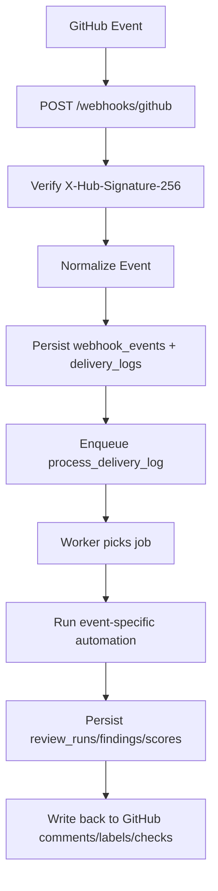

# FOSSMate Working Logic

This document explains the runtime logic from webhook ingest to GitHub output.

## 1. Runtime Architecture

Core backend components:
- `FastAPI` API server
- `webhooks` router (signature verification + idempotent ingest)
- in-memory task queue (current default)
- webhook processor worker
- services:
  - GitHub API service
  - LLM service abstraction
  - review orchestration service
- SQLite metadata database
- optional Qdrant (RAG path)

## 2. Lifecycle at a Glance

## 3. Event-Specific Logic

### `issues.opened`
1. Summarize issue text with provider.
2. Suggest labels (heuristics + LLM candidate labels).
3. Apply labels through GitHub API.
4. Post issue summary comment with suggested labels.
5. Persist result metadata in `review_runs`.

### `issue_comment.created`
1. Detect onboarding intent phrases.
2. Generate onboarding response.
3. Post onboarding comment.
4. Persist onboarding run result.

### `pull_request.opened` / `pull_request.synchronize`
1. Fetch changed files from GitHub API.
2. Build PR summary + file summaries.
3. Generate review suggestions (experimental).
4. Compute advisory score card.
5. Persist run, findings, and score rows.
6. Upsert PR review comment.
7. Create Check Run (if app has `Checks: Read and write`).

## 4. Idempotency and Duplicate Delivery Handling

Each webhook is assigned an idempotency key:
- `platform:delivery_id:event_type:action`

If a duplicate delivery key is seen, FOSSMate returns accepted response without reprocessing.

## 5. Data Model Write Path

Key tables used by runtime:
- `webhook_events`: raw payload storage
- `delivery_logs`: normalized delivery state (`queued`, `processing`, `done`, `failed`)
- `review_runs`: run-level result metadata
- `review_findings`: suggestion rows for PR reviews
- `score_cards`: advisory score dimensions
- `installation_settings`: feature flags and per-installation settings
- `developer_metrics`: developer-level aggregates (for reporting)

## 6. Provider Routing Logic

Provider is selected by `LLM_PROVIDER`.
Supported adapters:
- `ollama` (default OSS path)
- `gemini`
- `openai`
- `openrouter`
- `custom` (OpenAI-compatible)
- `azure_openai`
- `deepseek`
- `deepseek_r1`

Fallback path:
- If `LLM_FALLBACK_PROVIDER` is set, `FallbackLLMProvider` retries on failure.

## 7. Auth Logic

GitHub App auth path:
1. Build app JWT from `GITHUB_APP_ID` + private key.
2. Exchange JWT for installation token.
3. Use installation token for repository operations.

Private key sources:
- `GITHUB_PRIVATE_KEY` (inline)
- `GITHUB_PRIVATE_KEY_PATH` (recommended)

Fallback behavior:
- If placeholder key is present and `GITHUB_TOKEN` exists, code can fall back to PAT.
- This is for local troubleshooting only, not production.

## 8. Why Things Fail (Most Common)

403 on comments/labels:
- app not installed on repo
- missing Issues/Pull requests write permissions
- PAT fallback token missing required scopes

403 on check-runs:
- missing `Checks: Read and write` permission

401 webhook signature:
- secret mismatch between GitHub App and backend env

## 9. Production Readiness Notes

To make this run "on its own" in production:
- host backend on stable HTTPS domain
- point GitHub App webhook URL to production endpoint
- use app private key auth (not PAT fallback)
- ensure required permissions/events are configured
- use persistent DB and monitoring
- add queue retries/dead-letter for reliability
